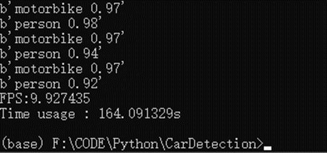

# CarDetection_YOLOv4

## 基于YOLOv4的多线程车辆和行人检测

在运行前要需要机器具有GPU，并且安装了Python以及Python相关的依赖，包括以下包：

* cuda以及cuDNN	
* Pytorch-cpu以及Pytorch-gpu	
* Opencv 
* Pillow 
* Numpy

1. 运行Anaconda环境下的命令行：

2. 进入CarDetection目录下：

3. 运行命令(2个参数，检测视频路径和使用线程数，中间用空格隔开)：
python video.py “检测视频路径” X

4. 开始检测：

5. 对视频播放窗口按下ESC键退出：

6. 在CarDetection目录下输出检测视频output.mp4。

